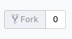

# Cash

**Table of Contents**
- [Objectives](#-objectives)
- [API](#-API)
- [Installation](#-installation)
- [Known Issues](#-known-issues)
- [Licence](#licence)


## Objectives


## API

The API give the latest rates  :
[API link](https://api.exchangeratesapi.io/latest)

Example of the link:


| Currencies ||   Rates    |
| ----------|---|------|
|MXN|Mexican Peso|21.994|
|AUD| Australian Dollar|1.6|
|HKD|Hong Kong Dollar|8.9344|
|RON|Romanian Leu|4.7431|
|HRK|Croatian Kuna|7.432|
|CHF| Swiss Francs|1.1363|
|IDR|Indonesian Rupiah|16067.0|
|CAD|Canadian Dollar|1.4971|
|USD|United States Dollar|1.1383|
|ZAR|South African Rand|16.1426|
|JPY|Japanese Yen|127.35|
|BRL|Brazilian Real|4.3037|
|HUF|Hungarian Forint|316.06|
|CZK|Czech Republic Koruna|25.636|
|NOK|Norwegian Krone|9.7268|
|INR|Indian Rupee |80.695|
|PLN|Polish Zloty|4.3096|
|ISK|Icelandic Króna|135.9|
|PHP|Philippine Peso|58.986|
|SEK|Swedish Krona|10.5003|
|ILS|Israeli New Sheqel|4.1331|
|GBP|British Pound Sterling|0.85968|
|SGD|Singapore Dollar|1.5396|
|CNY|Chinese Yuan|7.6332|
|TRY|Turkish Lira|6.123|
|MYR|Malaysian Ringgit|4.6374|
|RUB|Russian Ruble|74.9928|
|NZD|New Zealand Dollar|1.6656|
|KRW|South Korean Won|1282.12|
|THB|Thai Baht|36.113|
|BGN|Bulgarian Lev|1.9558|
|DKK|Danish Krone|7.4613|

EUR : EURO - 2019-03-01


## Installation

1. Fork the project via `github`




2. Clone your forked repository project `https://github.com/YOUR_USERNAME/3-musketeers`


```sh
❯ cd /path/to/workspace
❯ git clone git@github.com:YOUR_USERNAME/3-musketeers.git
```

3. Understand the library features


```sh
❯ cd /path/to/workspace/3-musketeers/cash
❯ npm i
❯ node bin/index.js
```

## Known Issues


## Licence

[Uncopyrighted](http://zenhabits.net/uncopyright/)
